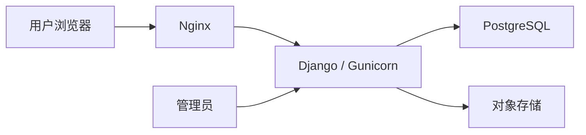

# 技术方案

## 已形成的技术路线

| 部分 | 方案 | 状态 |
|---|---|---|
| 后端 | Python 3.12 + Django | 后期方案取代早期 Next.js/Node.js 建议 |
| 页面 | Django Templates + Bootstrap | 简化学习和部署；连续播放需要额外导航设计 |
| 数据 | 开发 SQLite；正式 PostgreSQL | PostgreSQL 运行仍需实际验证 |
| 管理 | Django admin | 作品审核、举报、账号、论坛管理和操作日志 |
| 运行 | Docker Compose；Nginx + Gunicorn | 部署方案，尚未在本地恢复代码 |
| 媒体 | Lightsail Object Storage；数据库仅存文件引用 | 后期技术方案选择对象存储，初期是否本地存储需落实 |
| 服务器 | AWS Lightsail，US West (Oregon)，暂定 1GB | 待预发布压测验证配置；尚未购买 |
| HTTPS | Let’s Encrypt | 上线准备项 |
| 协作 | GitHub，Codespaces 优先预览 | 家中 Mac 无现成运行环境；本地保存文档不改变该偏好 |

本次只归纳历史路线，不锁定未经核对的依赖版本、套餐价格或优惠。购买前重新核对容量、流量、对象存储和备份的总费用。

## 数据结构

| 实体 | 主要内容与约束 |
|---|---|
| User / Profile | Django 认证；显示名、头像、简介、可选地区、主页、语言偏好、账号状态 |
| Track | 作者、名称、简介、音频封面引用、时长、语言、创作分类、AI 信息、创作者署名、权利确认、审核状态、发布时间、软删除 |
| Genre / TrackGenre | 多曲风关系 |
| Like / Favorite | 用户与作品组合唯一；事件时间用于时间窗口排行 |
| Comment | 作者、作品、正文、父评论、时间、审核与删除状态 |
| Play | 有效播放事件、时间及短期去重标识，不永久保留明文 IP |
| ForumCategory / Topic / Post | 版块、主题、回复、编辑时间、置顶/关闭、审核状态 |
| Report | 音乐/评论/主题/回复/用户；原因、状态、处理人及时间 |
| ModerationLog | 操作者、对象、动作、理由、时间 |

业务主要记录用 UUID；采用软删除与权限过滤。Django 自带用户主键是否调整，在第一次迁移前决定，避免项目已有数据库后强制更换。密码由 Django 认证系统哈希处理。账号删除对个人资料匿名化；备份保留与清理规则待实施。

论坛板块：原创作品交流、AI 音乐制作、作词与作曲、编曲与混音、工具与教程、合作招募、平台建议、版权与规则。

举报原因：版权、冒充歌手/未经许可声音、骚扰或仇恨、垃圾内容、不适当内容、其他。处理状态：待处理、审核中、已处理、驳回。

## 播放与排行榜

历史评分方案：有效播放 + 4×点赞 + 6×收藏 + 2×有效评论。同一用户对作品点赞/收藏只能存在一条；评论计分每位用户一次；作者自己的播放不计分；隐藏、软删除、未审核作品不进入榜单。

建议首版定义为：周榜最近 7 天事件，总榜全部有效事件，新歌榜筛选最近 30 天公开作品，并提供 HUMAN / AI_ASSISTED / AI_GENERATED 筛选。月榜、日榜和新歌分数窗口尚未最终统一，详见 migration-notes.md。

有效播放历史建议为“至少 30 秒或超过全曲 50%”，尚未固定去重窗口。实施时必须明确短歌阈值、重复播放窗口、匿名试听标识和撤销互动后的分数行为；采用服务端校验，避免只相信客户端上报时长。

## 连续播放器的技术补充（本次提出）

常规 Django 整页导航会重建 audio 元素，与历史“跨页面持续播放”要求冲突。建议保留全局播放器，站内导航只替换主要内容区，更新 URL 和历史记录；保留整页回退。可用少量 JavaScript 实现，不必因此更换整个技术栈。后续以桌面与手机的切页、返回、暂停、进度保持测试验证。

## 权限与媒体

公开读取仅允许已审核且公开的作品；私有媒体不能只依赖作品页面权限，应通过私有对象访问或受控媒体服务限制。后台角色与所有者权限统一由服务端执行。校验真实文件格式、大小、时长及封面内容，不只依赖扩展名。上传失败应清理孤立文件，状态变更需记录日志。

运行配置使用 .env 与 .env.example，密钥不提交仓库。正式部署关闭 DEBUG，配置允许域名、CSRF 来源、HTTPS、静态资源、上传限额、数据库与媒体备份。恢复演练和费用提醒为上线验收项。

## 基础代码恢复检查

历史记录提到 config、accounts、core、templates、locale、manage.py、requirements.txt / requirements.lock.txt、Dockerfile、compose.yaml、.devcontainer/devcontainer.json 和 scripts/setup-dev.sh。历史修复包括加载环境文件、Codespaces 主机与 CSRF 配置、语言中间件、中文翻译及固定依赖。

恢复后实际运行系统检查、迁移一致性检查、语言/健康测试，并验证 PostgreSQL、Docker 与 Codespaces。历史“7 项通过”只能作为旧环境结果，不能代替当前检查。
